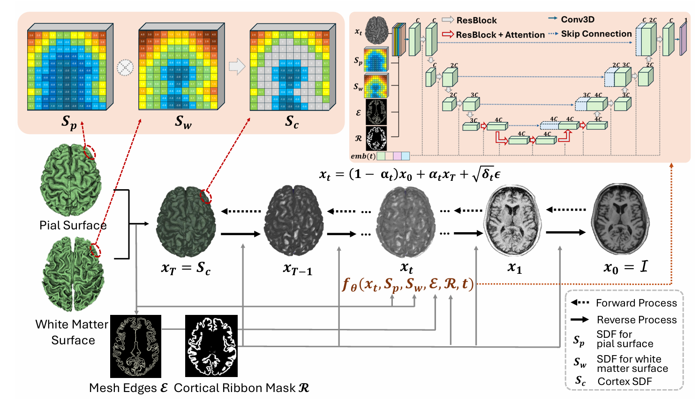

# 3D Shape-to-Image Brownian Bridge Diffusion for Brain MRI Synthesis from Cortical Surfaces

Official Pytorch Implementation of Paper - [Cor2Vox: 3D Shape-to-Image Brownian Bridge Diffusion for Brain MRI Synthesis from Cortical Surfaces](https://arxiv.org/abs/2502.12742) - Accepted by [IPMI 2025](https://ipmi2025.org/)

[](https://arxiv.org/abs/2502.12742)
[](https://doi.org/10.1007/978-3-031-96628-6_13)

<p align="center">
  
</p>

## Installation
1. Create environment: `cond env create -n c2v --file c2v_env.yml`
2. Activate environment: `conda activate c2v`


## Data preparation

For dataset the path should be formatted as:
```yaml
dataset_path/{format}Tr  # training data
dataset_path/{format}Val  # validation data
dataset_path/{format}Ts  # test data
```
for different formats of input.

After that, the dataset configuration should be specified in config file as:
```yaml
dataset_name: 'dataset_name'
dataset_config:
  img_folder: 'dataset_path/mri'
  shape_folder: 'dataset_path/shape'
  condition_folder: 'dataset_path/other_condition'

```


## Usage
After specifying the config file in `configs/c2v.yaml`, simply start training/evaluation by:

```commandline
sh train_c2v.sh
```
for training, and
```commandline
sh test_c2v.sh
```
for evaluation.

## Acknowledgement
Our code is implemented based on the [BBDM](https://github.com/xuekt98/BBDM), thanks!

## Citation
If you find this repository useful, please consider giving a star 🌟 and citing the paper:

```
@inproceedings{bongratz20253d,
  title={3D Shape-to-Image Brownian Bridge Diffusion for Brain MRI Synthesis from Cortical Surfaces},
  author={Bongratz, Fabian and Li, Yitong and Elbaroudy, Sama and Wachinger, Christian},
  booktitle={International Conference on Information Processing in Medical Imaging},
  pages={187--202},
  year={2025},
  organization={Springer}
}
```
